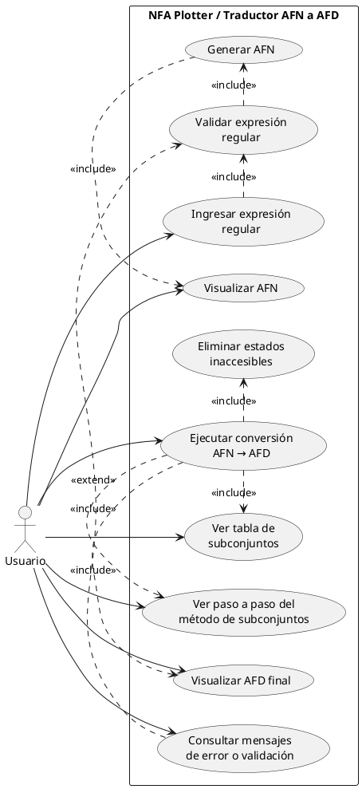
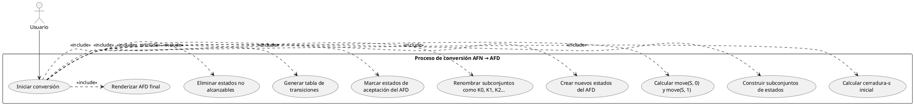
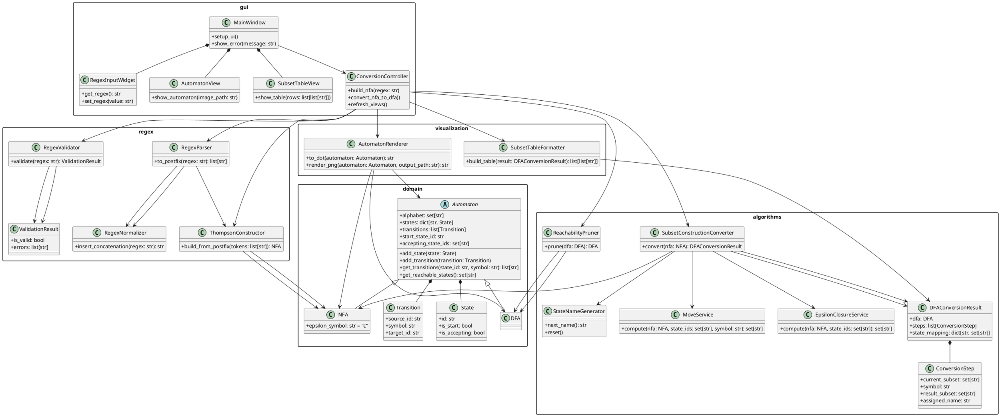

# General use cases diagram

```plantuml
@startuml
left to right direction
skinparam packageStyle rectangle

actor "Usuario" as User

rectangle "NFA Plotter / Traductor AFN a AFD" {
  usecase "Ingresar expresión\nregular" as UC1
  usecase "Validar expresión\nregular" as UC2
  usecase "Generar AFN" as UC3
  usecase "Visualizar AFN" as UC4
  usecase "Ejecutar conversión\nAFN → AFD" as UC5
  usecase "Ver tabla de\nsubconjuntos" as UC6
  usecase "Ver paso a paso del\nmétodo de subconjuntos" as UC7
  usecase "Eliminar estados\ninaccesibles" as UC8
  usecase "Visualizar AFD final" as UC9
  usecase "Consultar mensajes\nde error o validación" as UC10
}

User --> UC1
User --> UC4
User --> UC5
User --> UC6
User --> UC7
User --> UC9
User --> UC10

UC1 .> UC2 : <<include>>
UC2 .> UC3 : <<include>>
UC3 .> UC4 : <<include>>

UC5 .> UC6 : <<include>>
UC5 .> UC7 : <<include>>
UC5 .> UC8 : <<include>>
UC5 .> UC9 : <<include>>

UC10 .> UC2 : <<extend>>

@enduml
```

---

# Subset method diagram

```plantuml
@startuml
top to bottom direction
skinparam packageStyle rectangle

actor "Usuario" as User

rectangle "Proceso de conversión AFN → AFD" {
  usecase "Iniciar conversión" as UC1
  usecase "Calcular cerradura-ε\ninicial" as UC2
  usecase "Construir subconjuntos\nde estados" as UC3
  usecase "Calcular move(S, 0)\ny move(S, 1)" as UC4
  usecase "Crear nuevos estados\ndel AFD" as UC5
  usecase "Renombrar subconjuntos\ncomo K0, K1, K2..." as UC6
  usecase "Marcar estados de\naceptación del AFD" as UC7
  usecase "Generar tabla de\ntransiciones" as UC8
  usecase "Eliminar estados no\nalcanzables" as UC9
  usecase "Renderizar AFD final" as UC10
}

User --> UC1

UC1 .> UC2 : <<include>>
UC1 .> UC3 : <<include>>
UC1 .> UC4 : <<include>>
UC1 .> UC5 : <<include>>
UC1 .> UC6 : <<include>>
UC1 .> UC7 : <<include>>
UC1 .> UC8 : <<include>>
UC1 .> UC9 : <<include>>
UC1 .> UC10 : <<include>>

@enduml
```

---

# Class diagram

```plantuml
@startuml
skinparam packageStyle rectangle
skinparam classAttributeIconSize 0

package "domain" {
  class State {
    +id: str
    +is_start: bool
    +is_accepting: bool
  }

  class Transition {
    +source_id: str
    +symbol: str
    +target_id: str
  }

  abstract class Automaton {
    +alphabet: set[str]
    +states: dict[str, State]
    +transitions: list[Transition]
    +start_state_id: str
    +accepting_state_ids: set[str]
    +add_state(state: State)
    +add_transition(transition: Transition)
    +get_transitions(state_id: str, symbol: str): list[str]
    +get_reachable_states(): set[str]
  }

  class NFA {
    +epsilon_symbol: str = "ε"
  }

  class DFA {
  }

  Automaton <|-- NFA
  Automaton <|-- DFA

  Automaton *-- State
  Automaton *-- Transition
}

package "regex" {
  class RegexValidator {
    +validate(regex: str): ValidationResult
  }

  class ValidationResult {
    +is_valid: bool
    +errors: list[str]
  }

  class RegexNormalizer {
    +insert_concatenation(regex: str): str
  }

  class RegexParser {
    +to_postfix(regex: str): list[str]
  }

  class ThompsonConstructor {
    +build_from_postfix(tokens: list[str]): NFA
  }

  RegexValidator --> ValidationResult
  RegexParser --> RegexNormalizer
  ThompsonConstructor --> NFA
}

package "algorithms" {
  class EpsilonClosureService {
    +compute(nfa: NFA, state_ids: set[str]): set[str]
  }

  class MoveService {
    +compute(nfa: NFA, state_ids: set[str], symbol: str): set[str]
  }

  class ConversionStep {
    +current_subset: set[str]
    +symbol: str
    +result_subset: set[str]
    +assigned_name: str
  }

  class DFAConversionResult {
    +dfa: DFA
    +steps: list[ConversionStep]
    +state_mapping: dict[str, set[str]]
  }

  class StateNameGenerator {
    +next_name(): str
    +reset()
  }

  class ReachabilityPruner {
    +prune(dfa: DFA): DFA
  }

  class SubsetConstructionConverter {
    +convert(nfa: NFA): DFAConversionResult
  }

  SubsetConstructionConverter --> EpsilonClosureService
  SubsetConstructionConverter --> MoveService
  SubsetConstructionConverter --> StateNameGenerator
  SubsetConstructionConverter --> DFAConversionResult
  DFAConversionResult *-- ConversionStep
  ReachabilityPruner --> DFA
}

package "visualization" {
  class AutomatonRenderer {
    +to_dot(automaton: Automaton): str
    +render_png(automaton: Automaton, output_path: str): str
  }

  class SubsetTableFormatter {
    +build_table(result: DFAConversionResult): list[list[str]]
  }

  AutomatonRenderer --> Automaton
  SubsetTableFormatter --> DFAConversionResult
}

package "gui" {
  class MainWindow {
    +setup_ui()
    +show_error(message: str)
  }

  class RegexInputWidget {
    +get_regex(): str
    +set_regex(value: str)
  }

  class AutomatonView {
    +show_automaton(image_path: str)
  }

  class SubsetTableView {
    +show_table(rows: list[list[str]])
  }

  class ConversionController {
    +build_nfa(regex: str)
    +convert_nfa_to_dfa()
    +refresh_views()
  }

  MainWindow *-- RegexInputWidget
  MainWindow *-- AutomatonView
  MainWindow *-- SubsetTableView
  MainWindow --> ConversionController
}

ConversionController --> RegexValidator
ConversionController --> RegexParser
ConversionController --> ThompsonConstructor
ConversionController --> SubsetConstructionConverter
ConversionController --> ReachabilityPruner
ConversionController --> AutomatonRenderer
ConversionController --> SubsetTableFormatter

RegexValidator --> ValidationResult
RegexParser --> RegexNormalizer
RegexParser --> ThompsonConstructor
ThompsonConstructor --> NFA
SubsetConstructionConverter --> NFA
SubsetConstructionConverter --> DFAConversionResult
ReachabilityPruner --> DFA
AutomatonRenderer --> NFA
AutomatonRenderer --> DFA

@enduml
```